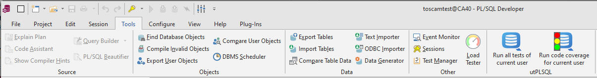
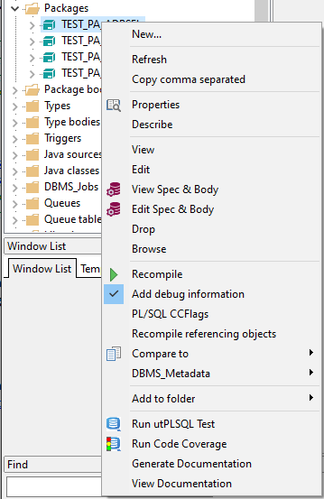
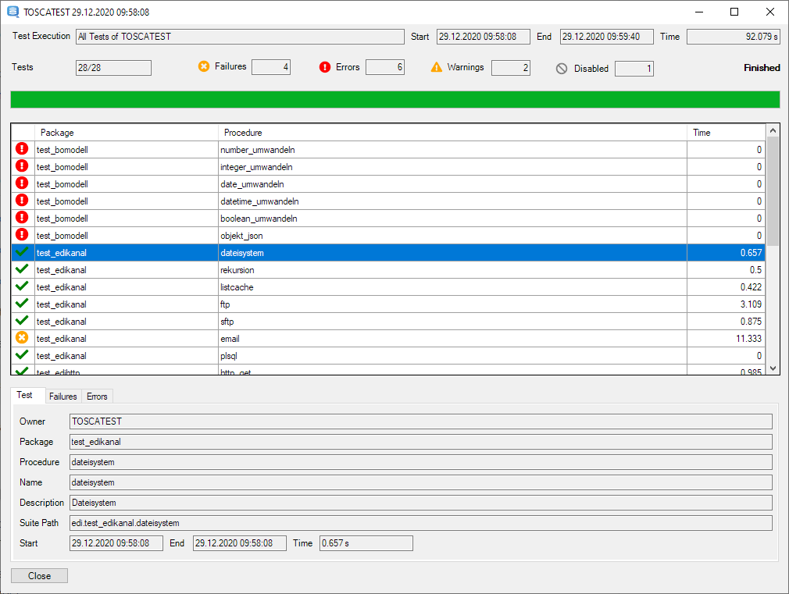

# utPLSQL Plugin for PLSQL Developer 

The utPLSQL Plugin integrates [utPLSQL](https://utplsql.org) with [Allround Automations PL/SQL Developer](https://www.allroundautomations.com/products/pl-sql-developer/).

## Running Tests and Code Coverage

The plugin adds a Button to the Tools ribbon to execute all tests of the current user or run code coverage.

In the object browser on Packages or Users there is a context menu entry to run the tests or code coverage of either the packages or the users.

## Viewing Results

The results are opened in a new window. If you've chosen code coverage the coverage report will be opened in the default browser. 

## Releases

Binary releases are published in the [releases section](https://github.com/utPLSQL/utPLSQL-PLSQL-Developer/releases).

## Installation

Copy PlsqlDeveloperUtPlsqlPlugin.dll to the PlugIns directory of your PL/SQL Developer installation.

## Issues

Please file your bug reports, enhancement requests, questions and other support requests within [Github's issue tracker](https://help.github.com/articles/about-issues/).

* [Questions](https://github.com/utPLSQL/utPLSQL-PLSQL-Developer/issues?q=is%3Aissue+label%3Aquestion)
* [Open enhancements](https://github.com/utPLSQL/utPLSQL-PLSQL-Developer/issues?q=is%3Aopen+is%3Aissue+label%3Aenhancement)
* [Open bugs](https://github.com/utPLSQL/utPLSQL-PLSQL-Developer/issues?q=is%3Aopen+is%3Aissue+label%3Abug)
* [Submit new issue](https://github.com/utPLSQL/utPLSQL-PLSQL-Developer/issues/new)

## How to Contribute

1. Describe your idea by [submitting an issue](https://github.com/utPLSQL/utPLSQL-PLSQL-Developer/issues/new)
2. [Fork the utPLSQL-PLSQL-Developer respository](https://github.com/utPLSQL/utPLSQL-PLSQL-Developer/fork)
3. [Create a branch](https://help.github.com/articles/creating-and-deleting-branches-within-your-repository/), commit and publish your changes and enhancements
4. [Create a pull request](https://help.github.com/articles/creating-a-pull-request/)

## How to Build

1. Open the PlsqlDeveloperUtPlsqlPlugin.sln solution in Visual Studio
2. Make sure to choose x64 as Platform target
3. Build the solution

## License

utPLSQL for PL/SQL Developer is licensed under the Apache License, Version 2.0. 
You may obtain a copy of the License at <http://www.apache.org/licenses/LICENSE-2.0>.

